# Sprawozdanie: bucket sort w OpenMP


### <center>Bartosz Walkowicz, Mateusz Front<center>

## Zadanie:

Zbadanie wpływu zwiększania liczby dostępnych procesorów na program współbieżny sortujący tablicę liczb za pomocą sortowania kubełkowego.
Program został napisany z wykorzystaniem technologii OpenMP i dwóch wersjach.
W wersji pierwszej kubełki były globalne i każdy wątek musiał synchronizować dostęp do niego. Następnie każdy kubełek był sortowany i kopiowany w odpowiednie miejsce w tablicy. W drugiej wersji każdy wątek posiadał swoje kubełki do których wpisywał liczby i je sortował. Likwidowało to potrzebę synchronizacji, niemniej jednak przed wpisaniem do tablicy należało scalić kubełki poszczególnych wątków.

Pomiary dla obu wersji wykonano w 2 wariantach: skalowanym i nieskalowanym.
W wariancie pierwszym zwiększano rozmiar tablicy proporcjonalnie do ilości dostępnych wątków. W drugim natomiast rozmiar tablicy pozostawał taki sam niezależnie od ilości wykonujących się wątków.

W obu wariantah programy uruchamiano dla pierwotnych rozmiarów tablic: 4e7, 8e7, oraz 1e8. Natomiast liczbę wątków zwiększano od 1 do 8.

## Architektura:
```
os              : linux
platform        : ubuntu-16.04
kernel          : 4.13.0-41-generic
cores           : 4
virtual threads : 8
vendor_id       : GenuineIntel
cpu family      : 6
model           : 94
model name      : Intel(R) Core(TM) i7-6700HQ CPU @ 2.60GHz
stepping        : 3
microcode       : 0x7c
cache size      : 6144 KB
physical id     : 0
siblings        : 8
core id         : 3
cpu cores       : 4
apicid          : 7
initial apicid  : 7
fpu             : yes
fpu_exception   : yes
cpuid level     : 22
wp              : yes
flags           : fpu vme de pse tsc msr pae mce cx8 apic sep mtrr pge mca cmov pat pse36 clflush dts acpi mmx fxsr sse sse2 ss ht tm pbe syscall nx pdpe1gb rdtscp lm constant_tsc art arch_perfmon pebs bts rep_good nopl xtopology nonstop_tsc cpuid aperfmperf tsc_known_freq pni pclmulqdq dtes64 monitor ds_cpl vmx est tm2 ssse3 sdbg fma cx16 xtpr pdcm pcid sse4_1 sse4_2 x2apic movbe popcnt aes xsave avx f16c rdrand lahf_lm abm 3dnowprefetch cpuid_fault epb invpcid_single pti retpoline intel_pt rsb_ctxsw tpr_shadow vnmi flexpriority ept vpid fsgsbase tsc_adjust bmi1 hle avx2 smep bmi2 erms invpcid rtm mpx rdseed adx smap clflushopt xsaveopt xsavec xgetbv1 xsaves dtherm ida arat pln pts hwp hwp_notify hwp_act_window hwp_epp
bugs            : cpu_meltdown spectre_v1 spectre_v2
bogomips        : 5184.00
clflush size    : 64
cache_alignment : 64
address sizes   : 39 bits physical, 48 bits virtual
```

## Wykresy:
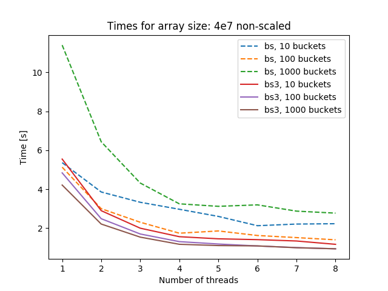
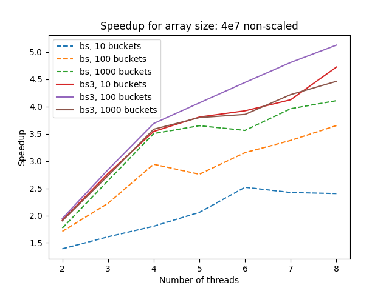
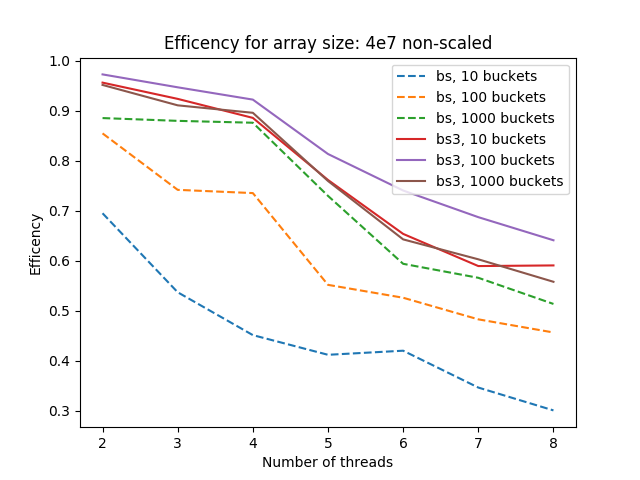
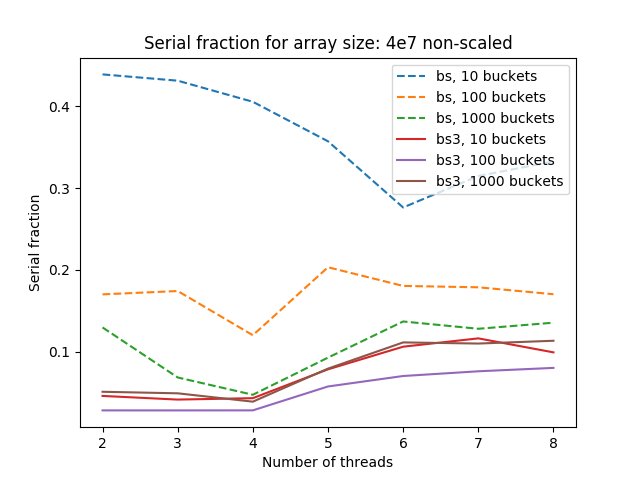
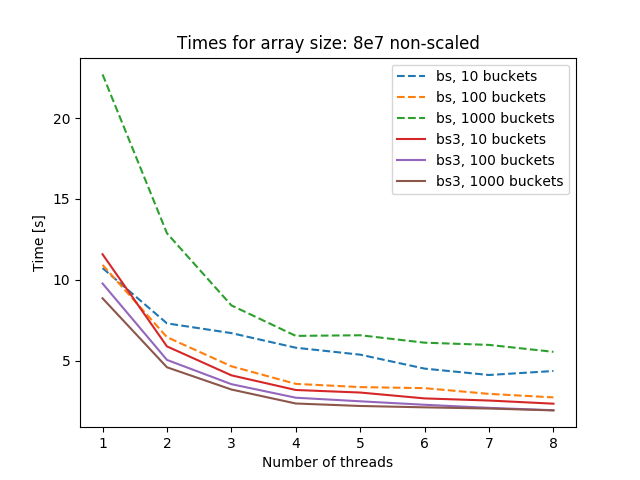
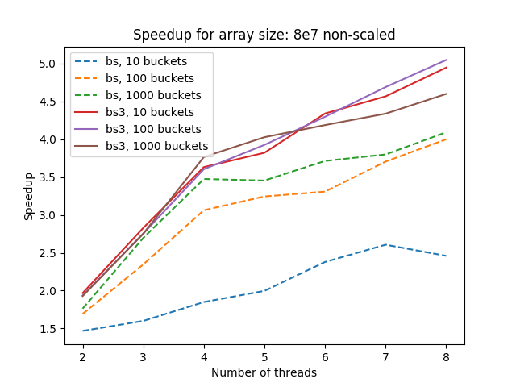
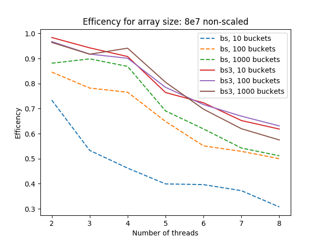
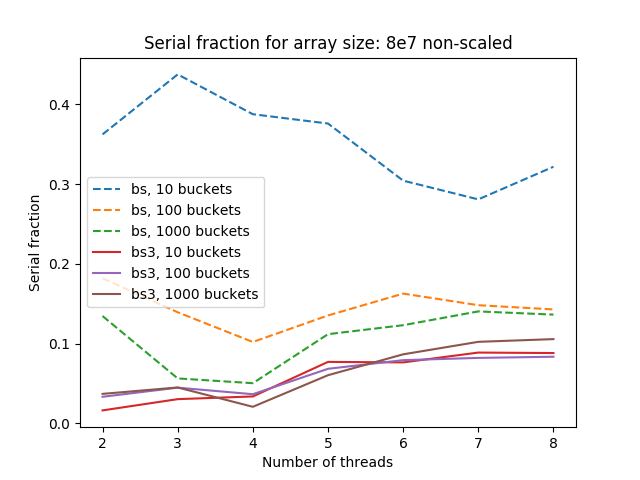
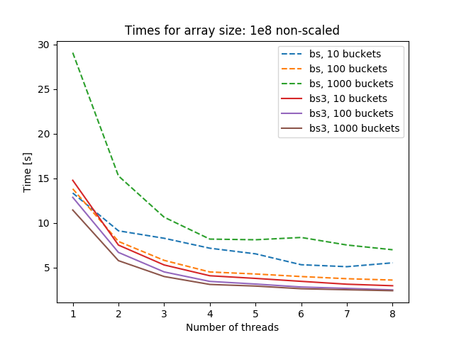
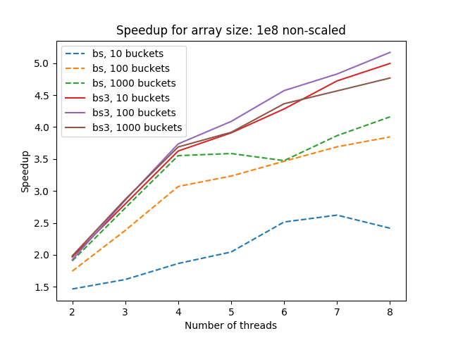

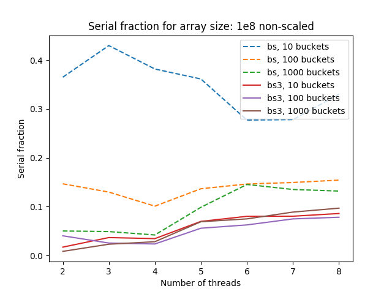

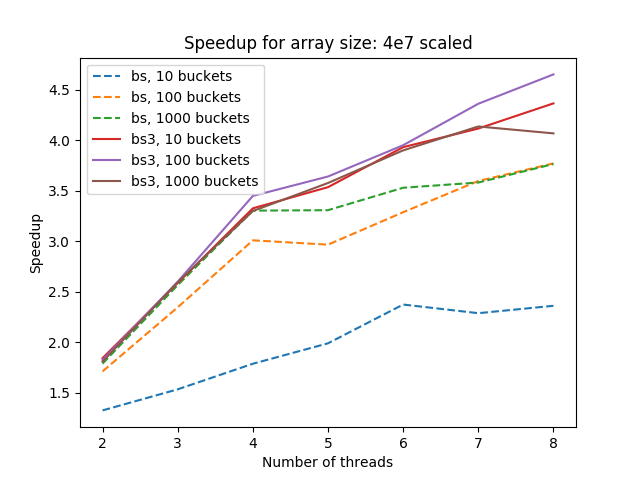
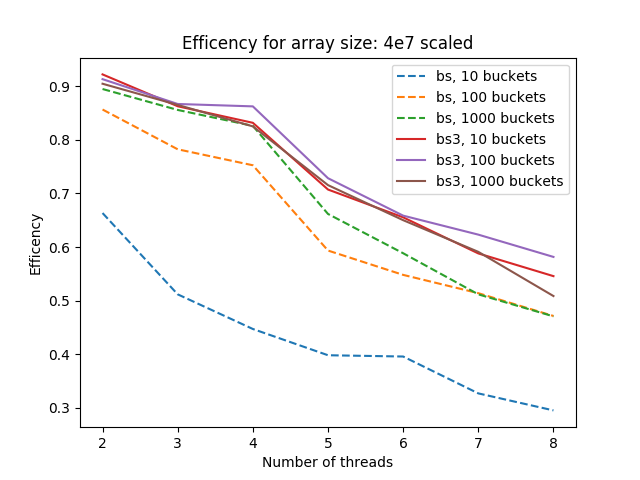
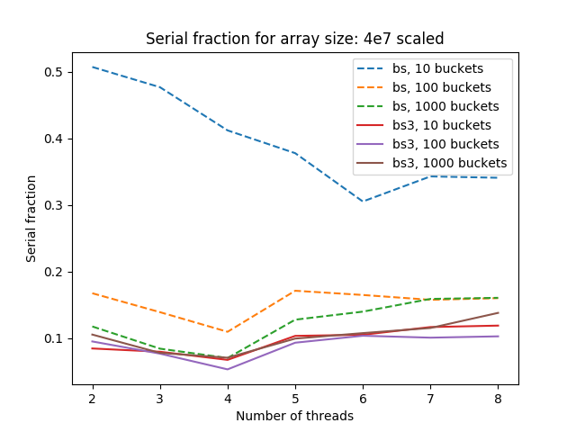
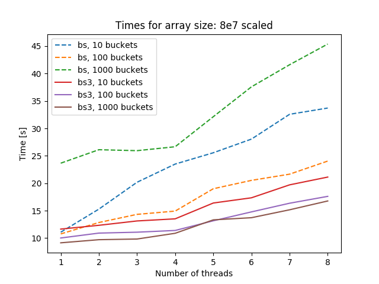
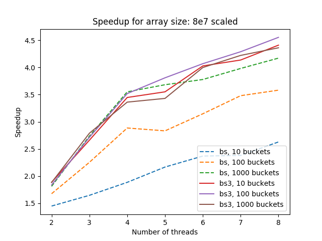

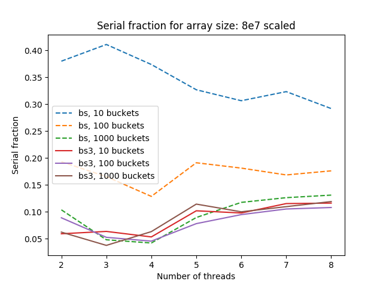
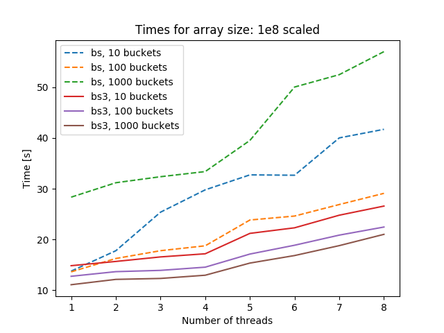
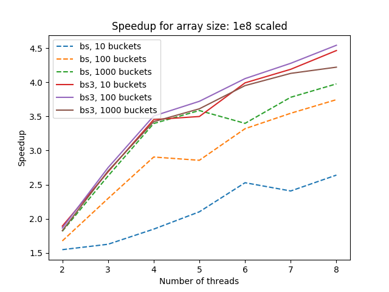
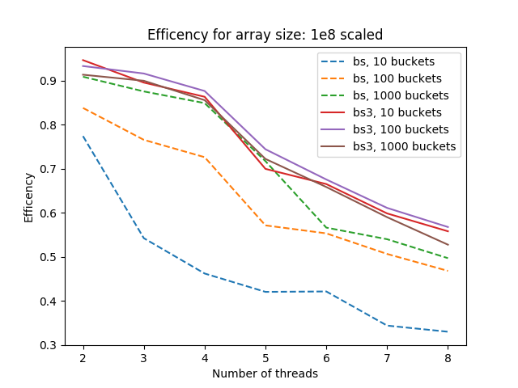
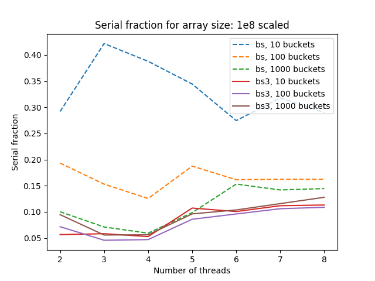

## Wnioski:
- Wersja trzecia bucket sorta prawie zawsze działa szybciej od wersji drugiej, co jest spowodowane brakiem konieczności synchronizacji dostępu do kubełków.
- Czasy dosyć istotnie zależą od ilości kubełków:
  - Większa ilość kubełków poprawia wydajność samego algorytmu bucket sort, ale zbyt duża ilość powoduje opóźnienia, które mogą być spowodowane częstszym przeładowywaniem cache.
  - W wersji drugiej mała ilość kubełków powoduje dodatkowe opóźnienia związane ze zwiększeniem ilości jednoczesnych dostępów do kubełka.
- Brak wzrostu przyspieszenia przy zwiększeniu liczby wątków z 4 do 5 może się wiązać z architekturą systemu (8 wątków, ale tylko 4 fizyczne core'y)
